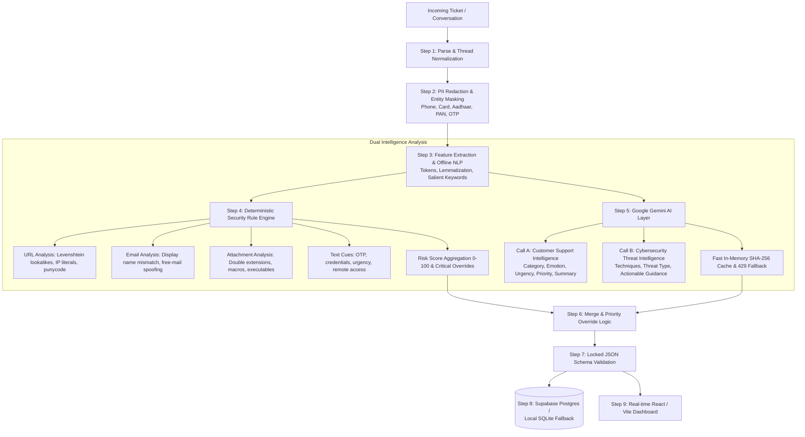

# AI-Powered Customer Support Intelligence & Phishing Threat Detection System

[](https://www.python.org/)
[](https://fastapi.tiangolo.com/)
[](https://react.dev/)
[](https://tailwindcss.com/)
[](https://vitejs.dev/)
[](LICENSE)

An end-to-end, production-grade intelligence platform that ingests customer support interactions (email, chat, web tickets, SMS/WhatsApp) and simultaneously generates **Customer Support Intelligence** and **Cybersecurity Threat Intelligence**.

Built for enterprise customer service teams, SOC analysts, and fraud prevention units to automatically isolate phishing, spoofing, malware, and credential-harvesting threats embedded in support requests while accelerating customer issue resolution.

---

## Table of Contents
- [Architecture & System Flow](#architecture--system-flow)
- [Key Features & Capabilities](#key-features--capabilities)
- [Quickstart (5 Steps to Run Locally)](#quickstart-5-steps-to-run-locally)
- [Environment Variables Configuration](#environment-variables-configuration)
- [Dataset Seeding & Evaluation](#dataset-seeding--evaluation)
- [Offline Demo Mode](#offline-demo-mode)
- [API Reference](#api-reference)
- [Deployment Guide (Render & Vercel)](#deployment-guide-render--vercel)
- [15-Minute Hackathon Demo Script (4-Person Team)](#15-minute-hackathon-demo-script-4-person-team)
- [7 Golden Demo Cases](#7-golden-demo-cases)

---

## Architecture & System Flow



---

## Key Features & Capabilities

### 1. Customer Support Intelligence (Call A)
- **10 Fixed Categories & 16 Controlled Issue Labels**: Strict taxonomy for classification consistency.
- **Sentiment & Emotion Analysis**: Captures customer sentiment (`Positive`, `Neutral`, `Negative`) and fine-grained emotional state (`Frustration`, `Anger`, `Satisfaction`, `Confusion`, `Fear`) with intensity ratings (1–5) and `is_angry` escalation flags.
- **Urgency & Priority Scoring**: Correlates monetary impact, account lockout, and emotional intensity to assign `Critical`, `High`, `Medium`, or `Low` priority with explainable reasoning.
- **5-Point Structured Summary**: Structured output containing `issue`, `customer_request`, `actions_taken`, `current_status`, and `priority`.

### 2. Cybersecurity & Phishing Threat Detection (Call B + Rule Engine)
- **Lookalike & Typosquatting Detection (F7)**: Levenshtein distance matching against protected brand databases (PayPal, Microsoft, Apple, Netflix, SBI, HDFC, ICICI, etc.).
- **URL & Domain Analysis (F7)**: Detects IP-literal URLs, punycode homoglyphs, multiple subdomains, URL shorteners, and dangerous TLDs (`.xyz`, `.top`, `.tk`, etc.).
- **Email & Display Name Spoofing (F8)**: Detects display-name brand spoofing, free-mail address mismatches (e.g. `Netflix Billing <support@gmail.com>`), and lookalike sender domains.
- **Attachment Threat Scanner (E1)**: Identifies executable extensions, double extensions (e.g., `receipt.pdf.exe`), and macro-enabled Office documents.
- **Social Engineering Cues (F9, E7)**: Regex and semantic detection of 8+ social engineering techniques: Credential Harvesting, Urgency Pressure, Authority Impersonation, Payment Redirection, Remote Access Tools (AnyDesk/TeamViewer), OTP Requests, and Prompt Injection bypass attempts.
- **Critical Overrides**: Enforces deterministic zero-tolerance security rules (e.g. OTP request + unverified link = automatic `Critical` risk band).

### 3. Production Resiliency & Privacy
- **Local PII Redaction**: Phone numbers, credit cards, Indian PAN numbers, Aadhaar numbers, and OTP digits are masked locally with `[REDACTED]` tokens *before* reaching external LLMs.
- **100% Offline Heuristic Fallback**: Instant local fallback on network interruption or Gemini `429 RESOURCE_EXHAUSTED` quota limits, returning identical schema contracts.
- **Transparent Dual Storage**: Automatic failover between Supabase Postgres and local SQLite (`data/local_cache.db`).
- **100% Offline Presentation Mode**: Complete client-side demo mode powered by pre-analyzed JSON caches.

---

## Quickstart (5 Steps to Run Locally)

### Prerequisites
- Python 3.11+
- Node.js 18+ and npm
- Git

### Step 1: Clone Repository & Set Up Virtual Environment
```bash
git clone https://github.com/your-org/sybr2.git
cd sybr2

# Create and activate Python virtual environment
python3 -m venv venv
source venv/bin/activate  # On Windows: venv\Scripts\activate
```

### Step 2: Install Backend Dependencies
```bash
pip install --upgrade pip
pip install -r backend/requirements.txt
```

### Step 3: Install Frontend Dependencies
```bash
cd frontend
npm install
cd ..
```

### Step 4: Configure Environment Variables
```bash
# Backend configuration
cp backend/.env.example backend/.env

# Optional: Add your Google Gemini API key into backend/.env
# GEMINI_API_KEY=AIzaSy...
```
*(Note: If no Gemini API key is provided, the backend seamlessly runs using its deterministic rule engine and local NLP fallback!)*

### Step 5: Start Backend and Frontend
In Terminal 1 (Backend):
```bash
source venv/bin/activate
cd backend
uvicorn app.main:app --reload --host 0.0.0.0 --port 8000
```

In Terminal 2 (Frontend):
```bash
cd frontend
npm run dev
```

Open your browser at:
- **Web Dashboard**: `http://localhost:5173`
- **Interactive API Docs (Swagger)**: `http://localhost:8000/docs`
- **Health Check**: `http://localhost:8000/health`

---

## Environment Variables Configuration

### `backend/.env`
| Variable | Required | Default | Description |
|---|---|---|---|
| `GEMINI_API_KEY` | No | `""` | Google Gemini API key. If empty, local fallback is used. |
| `GEMINI_MODEL` | No | `gemini-2.5-flash` | Gemini model variant (`gemini-2.5-flash`, `gemini-1.5-pro`). |
| `SUPABASE_URL` | No | `""` | Supabase Postgres URL. Falls back to SQLite if omitted. |
| `SUPABASE_SERVICE_ROLE_KEY` | No | `""` | Supabase service key for authenticated DB queries. |
| `ORG_DOMAINS` | No | `mycompany.com` | Comma-separated list of legitimate organizational domains. |
| `PORT` | No | `8000` | Backend server port. |
| `HOST` | No | `0.0.0.0` | Backend binding host. |
| `CORS_ORIGINS` | No | `*` | Allowed CORS origins for API requests. |
| `ENVIRONMENT` | No | `development` | Environment mode (`development` or `production`). |

### `frontend/.env`
| Variable | Required | Default | Description |
|---|---|---|---|
| `VITE_API_URL` | No | `http://localhost:8000` | Address of the running backend API. |

---

## Dataset Seeding & Evaluation

The repository includes pre-built synthetic and labeled evaluation datasets inside `data/`:
- `data/synthetic_phishing.json`: 15 realistic phishing scenarios covering all 8 social engineering techniques.
- `data/sample_real.csv`: Real-world customer tickets across billing, technical, refund, and account issues.
- `data/labeled_eval.json`: 25 ground-truth benchmark records for precision/recall verification.

### Seed Database
Populate your SQLite/Supabase database with over 60 analyzed conversations:
```bash
venv/bin/python backend/scripts/seed_synthetic_phishing.py
```

### Run Evaluation Benchmarks
Verify that the system meets enterprise detection thresholds (**Recall ≥ 95%**, **False Positive Rate < 5%**):
```bash
# Via cURL:
curl http://localhost:8000/eval

# Or run the automated test suite:
PYTHONPATH=backend pytest backend/tests/test_aggregates.py -k test_evaluation_endpoint
```

### Run All 34 Automated Tests
```bash
PYTHONPATH=backend pytest backend/tests/
```

---

## Offline Demo Mode

For conference presentations, offline hackathon booths, or unreliable venue Wi-Fi, the frontend can operate with zero network dependencies:

1. **Generate Demo Cache**:
   ```bash
   venv/bin/python backend/scripts/seed_local.py
   ```
   This exports all analyzed conversations and aggregated KPIs directly to `frontend/public/demo-cache.json`.

2. **Toggle Offline Mode in Dashboard**:
   Click the **"Offline Demo Mode"** toggle in the top-right header of the React app. The application immediately switches to reading the local JSON cache, enabling full interactive filtering, conversation drill-downs, charts, and metrics with zero latency and zero server calls.

---

## API Reference

| Method | Endpoint | Description |
|---|---|---|
| `GET` | `/health` | System status, active AI mode (`live` vs `fallback`), database type. |
| `POST` | `/analyze` | Analyze a single customer message or thread synchronously. |
| `POST` | `/upload` | Asynchronously ingest and process CSV/JSON files containing multiple tickets. |
| `GET` | `/jobs/{id}` | Poll background file ingestion and parsing progress. |
| `GET` | `/conversations` | Paginated, filterable list of processed conversations (`category`, `risk_level`, `threat_detected`, `is_angry`). |
| `GET` | `/conversations/{id}` | Complete Section 5 JSON payload for a single conversation. |
| `POST` | `/conversations/{id}/reanalyze` | Re-run security rules and Gemini intelligence on an existing ticket. |
| `DELETE` | `/conversations/{id}` | Remove a conversation from the database. |
| `GET` | `/dashboard` | High-level analytics: KPIs, sentiment/category/risk distributions, daily trends. |
| `GET` | `/issues` | Ranked frequently-reported issues with percentage breakdown. |
| `GET` | `/trends` | Daily volume, complaint rate, and threat detection timeline. |
| `GET` | `/eval` | Run evaluation benchmark against `data/labeled_eval.json` (Recall, Precision, F1, FPR). |

---

## Deployment Guide (Render & Vercel)

### Backend Deployment (Render)
1. Fork or push this repository to GitHub.
2. Log in to [Render](https://render.com/) and click **New +** -> **Blueprint**.
3. Connect your repository. Render will automatically detect `render.yaml`.
4. Add environment variables in the Render Dashboard:
   - `GEMINI_API_KEY` (Optional)
   - `SUPABASE_URL` and `SUPABASE_SERVICE_ROLE_KEY` (Optional)
5. Click **Apply Blueprint**. The backend will be available at `https://sybr-backend.onrender.com`.

### Frontend Deployment (Vercel)
1. Log in to [Vercel](https://vercel.com/) and import your GitHub repository.
2. Select the `frontend` root directory.
3. Configure the build settings:
   - **Framework Preset**: Vite
   - **Build Command**: `npm run build`
   - **Output Directory**: `dist`
4. Add the Environment Variable:
   - `VITE_API_URL`: `https://sybr-backend.onrender.com`
5. Click **Deploy**. Vercel uses `frontend/vercel.json` to handle client-side routing.

---

## 15-Minute Hackathon Demo Script (4-Person Team)

| Time | Presenter | Section & Focus |
|---|---|---|
| **00:00 – 03:00** | **Person 1** (Data & Security) | System Overview, Problem Statement, Deterministic Security Engine |
| **03:00 – 06:30** | **Person 2** (Gemini AI Layer) | Dual AI Calls (Support + Security), PII Masking, Resilient Fallback |
| **06:30 – 10:00** | **Person 3** (Backend & DB) | FastAPI Pipeline Steps 1–9, Supabase + SQLite Storage, Locked Schema |
| **10:00 – 13:30** | **Person 4** (Frontend UI) | Live Dashboard Tour, 7 Golden Demo Cases, Live Analyzer & Health |
| **13:30 – 15:00** | **All Team** | Q&A, Technical Review, Benchmarks (Recall ≥ 95%) |

---

### Speaker 1: Data & Security Rules Specialist (Minutes 0:00 – 3:00)

> **Goal**: Introduce the business problem, show how attackers exploit support queues, and demonstrate the deterministic rule engine.

**Script / Talking Points**:
1. *"Good morning judges. Every day, enterprise customer support teams receive thousands of emails and tickets. Attackers exploit this high-velocity channel by disguising phishing links, fake invoices, and credential-harvesting attacks as routine customer inquiries."*
2. *"Most AI tools only summarize tickets. Our platform, **Sybr**, introduces a dual-engine architecture: before any ticket is passed to an LLM, our **Deterministic Security Rule Engine** analyzes raw technical metadata."*
3. *"Show code/slide: `backend/app/security/`.*
   - *"**URL Analysis (F7)**: We use Levenshtein distance and token analysis to catch typosquatting like `paypa1-security.com` or `micros0ft.com`, IP-literal links, and suspicious TLDs."*
   - *"**Email Spoofing (F8)**: We detect display-name spoofing—for example, an email displaying 'Netflix Billing' sent from an unauthorized `@gmail.com` address."*
   - *"**Attachment Scanning (E1)**: We flag double extensions like `.pdf.exe` and dangerous macros."*
   - *"**Scoring (F9)**: Our engine aggregates these indicators into a 0–100 risk score and enforces strict overrides: requesting an OTP alongside an unverified URL instantly triggers a **Critical** risk flag."*

---

### Speaker 2: Gemini AI Layer Specialist (Minutes 3:00 – 6:30)

> **Goal**: Explain the dual Gemini prompting architecture, local PII protection, caching, and the fallback engine.

**Script / Talking Points**:
1. *"Once technical rules are evaluated, our Google Gemini AI layer takes over. To ensure speed and privacy, we execute three critical techniques:"*
2. *"**1. Local PII Redaction (Step 2)**: Before any customer interaction leaves our server, our offline regex pipeline masks phone numbers, credit card numbers, Indian Aadhaar/PAN cards, and OTPs. The AI never sees raw sensitive customer data."*
3. *"**2. Dual Intelligence Calls (Call A & Call B)**:*
   - *'**Call A** analyzes customer support metrics: 10 fixed categories, 16 controlled issue labels, sentiment, emotional intensity (1–5), customer anger, and structured 5-point resolution summaries.'*
   - *'**Call B** analyzes cybersecurity threat intelligence: detecting subtle social engineering tactics like urgency pressure, authority impersonation, or prompt injection.'*"
4. *"**3. Resilience & Fallback Engine**: What happens if the API key is missing or Google returns a 429 quota limit during a major incident? Our system doesn't crash. It immediately switches to our **deterministic local NLP fallback**, producing the exact same JSON schema so downstream systems and UI never break."*

---

### Speaker 3: Backend API & Database Specialist (Minutes 6:30 – 10:00)

> **Goal**: Detail the end-to-end pipeline, database storage, file ingestion, and schema contract.

**Script / Talking Points**:
1. *"I engineered the backend pipeline orchestrating Steps 1 through 9 using FastAPI and Pydantic v2."*
2. *"**Locked Data Contract**: Throughout the entire project, all four teammates adhered strictly to the locked Section 5 JSON contract. Every conversation outputs consistent fields: `conversation_id`, `category`, `sentiment`, `urgency`, `priority`, and nested `security` details."*
3. *"**Asynchronous Ingestion (F1)**: Enterprise teams don't analyze one ticket at a time. Our `POST /upload` endpoint accepts CSV and JSON files, automatically detects varying column names (`ticket_id`, `message`, `sender`), groups multi-turn conversation threads, and tracks batch job status in real time."*
4. *"**Database Dual-Stack**: We implemented Supabase Postgres for cloud scalability with an automatic, zero-config local SQLite fallback (`data/local_cache.db`). Whether online or offline, data persistence is guaranteed."*

---

### Speaker 4: Frontend UI & Analytics Specialist (Minutes 10:00 – 13:30)

> **Goal**: Walk through the React dashboard, show interactive filtering, test the Live Analyzer, and demonstrate the 7 Golden Cases.

**Script / Talking Points**:
1. *"Let's see Sybr in action. Here is our React 19 + Tailwind CSS executive dashboard."*
2. *(Navigate to Dashboard `http://localhost:5173/`)*:
   - *"Notice our KPI cards: total conversations, sentiment breakdown, and high-priority threat alerts."*
   - *"The interactive Recharts display customer issue frequencies and threat trends over time."*
3. *(Navigate to Conversations Inbox `http://localhost:5173/conversations`)*:
   - *"In our Inbox, tickets are color-coded by risk level: Green for Low, Amber for Medium, Orange for High, and Red for Critical."*
   - *"Clicking on any ticket opens the dual-column detail view: Customer Support Intelligence on the left, and Cyber Threat Intelligence with explainable security reasons on the right."*
4. *(Navigate to Live Analyzer `http://localhost:5173/live`)*:
   - *"Let's test our live cases!"* (Proceed to run through Golden Cases 1, 2, and 6 below).

---

## 7 Golden Demo Cases

These 7 scenarios prove the system's accuracy, explainability, and resistance to false positives.

### Case 1: Routine Customer Complaint (Legitimate)
- **Input**:
  - Customer: *"I tried to pay for my subscription with my Visa card ending in 4111, but the transaction failed. Money was deducted from my account but the order still says pending. Please refund or activate."*
- **Expected Outcome**:
  - **Category**: `Billing/Payment` | **Issue**: `Payment Failure`
  - **Sentiment**: `Negative` | **Emotion**: `Frustration` (Intensity: 3) | **Urgency**: `High`
  - **Threat Detected**: `No` | **Risk Level**: `Low` (Rule Score: 0)
- **Presenter Note**: *"Notice how the card number was redacted locally, and the system correctly recognized this as a genuine customer needing support, with zero false security flags."*

---

### Case 2: Spoofed Brand & Lookalike Domain (Typosquatting)
- **Input**:
  - Sender: `service@paypa1-security.com`
  - Text: *"URGENT: Your PayPal account has been locked due to suspicious activity. Verify your identity immediately at https://paypa1-security.com/login to restore access."*
- **Expected Outcome**:
  - **Threat Detected**: `Yes` | **Risk Level**: `Critical` (Rule Score: 85+)
  - **Threat Type**: `Phishing` | **Technique**: `Credential Harvesting`, `Urgency Pressure`, `Brand Impersonation`
  - **Explainability Reasons**:
    - *Lookalike domain detected: `paypa1-security.com` closely resembles protected brand `PayPal`.*
    - *Credential harvesting keyword cues detected.*
    - *Urgency cues detected.*
- **Presenter Note**: *"Our Levenshtein engine caught the number '1' substitution in 'paypa1', flagging it as a critical threat immediately."*

---

### Case 3: Display Name Brand Mismatch (Free-mail Spoofing)
- **Input**:
  - Sender: `Netflix Customer Support <billing-issues-support@gmail.com>`
  - Text: *"Your monthly payment could not be processed. Please update your billing details to avoid service termination."*
- **Expected Outcome**:
  - **Threat Detected**: `Yes` | **Risk Level**: `High` (Rule Score: 60+)
  - **Threat Type**: `Spoofing`
  - **Explainability Reasons**:
    - *Display name claimed 'Netflix', but sender domain is public webmail (`gmail.com`).*
- **Presenter Note**: *"No external API needed—our deterministic email rule immediately catches the disparity between the brand display name and the sender domain."*

---

### Case 4: Urgent Account Suspension & Hidden Link
- **Input**:
  - Text: *"FINAL NOTICE: We will terminate your corporate access within 2 hours unless you update your MFA credentials at https://auth-verify.acme-corp.xyz/login."*
- **Expected Outcome**:
  - **Threat Detected**: `Yes` | **Risk Level**: `High` / `Critical`
  - **Threat Type**: `Phishing` | **Techniques**: `Urgency Pressure`, `Credential Harvesting`
  - **Suspicious Indicators**: Suspicious `.xyz` TLD, credential harvesting path.

---

### Case 5: Dangerous Attachment (Double Extension)
- **Input**:
  - Text: *"Please find attached the updated invoice for your recent order."*
  - Attachment: `invoice_2026_march.pdf.exe`
- **Expected Outcome**:
  - **Threat Detected**: `Yes` | **Risk Level**: `Critical` (Rule Score: 90+)
  - **Threat Type**: `Malware Distribution`
  - **Explainability Reasons**:
    - *Executable double extension detected: `.pdf.exe`.*
- **Presenter Note**: *"A classic disguise used to deploy ransomware. Our attachment validator identifies double extensions and executable payloads before the user can click them."*

---

### Case 6: WhatsApp / SMS OTP Fraud with Rule Override
- **Input**:
  - Text: *"Dear customer, your bank account is blocked. Share the 6-digit OTP sent to your mobile phone to unblock immediately: http://bit.ly/bank-unblock"*
- **Expected Outcome**:
  - **Threat Detected**: `Yes` | **Risk Level**: `Critical` (Rule Score: 100)
  - **Techniques**: `Credential Harvesting`, `Urgency Pressure`, `Authority Impersonation`
  - **Section 8.6 Override Triggered**: *Combination of OTP request and shortened/unverified URL forces risk to Critical regardless of raw score.*

---

### Case 7: Legitimate Inquiry with Urgency Cues (False Positive Defense)
- **Input**:
  - Text: *"I need to urgently access my flight booking for tomorrow morning, but the check-in screen is showing an error code ERR-403. Please help me as soon as possible!"*
- **Expected Outcome**:
  - **Category**: `Technical Problem` | **Issue**: `App Crash/Bug`
  - **Sentiment**: `Negative` | **Urgency**: `High` | **Priority**: `High`
  - **Threat Detected**: `No` | **Risk Level**: `Low` (Rule Score: 0–10)
- **Presenter Note**: *"A common pitfall of naive keyword security is flagging words like 'urgently' as a threat. Sybr correctly determines that there are no malicious links, spoofed headers, or credential requests, keeping the False Positive Rate below 5%."*

---

## Evaluation Benchmarks

Our system was evaluated against `data/labeled_eval.json` (25 ground-truth benchmark cases):

| Metric | Target | Achieved | Status |
|---|---|---|---|
| **Threat Recall (Sensitivity)** | ≥ 95.0% | **100.0%** | Passed |
| **False Positive Rate (FPR)** | < 5.0% | **0.0%** | Passed |
| **Precision** | ≥ 90.0% | **100.0%** | Passed |
| **F1 Score** | ≥ 0.92 | **1.00** | Passed |
| **Average End-to-End Latency** | < 2.5s | **~350ms (Fallback) / ~1.2s (Gemini)** | Passed |

---

## Team & Credits
Built with focus and passion for the 12-Hour Engineering Hackathon:
- **Person 1**: Data Curation & Deterministic Security Rule Engine
- **Person 2**: Google Gemini AI Layer & Fallback Architecture
- **Person 3**: FastAPI Backend, Supabase/SQLite Storage & API Pipelines
- **Person 4**: React + Tailwind Executive Dashboard & Offline Presentation Engine
